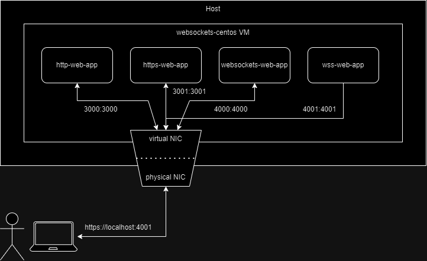

# websockets

we want to create a flow that provisions VMs (foe example rhel/centos), deploys and tests different web apps that communicate using different protocols.
to do so we will provision a local VM as a lab using Vagrant, and deploy on it the web apps using Docker.

for now, we will compare between the following protocols:

1. http
2. https
3. websocket - full-duplex communication channels over a single TCP connection.
4. secure websocket (WSS) - websocket over TLS.

we can check the protocols in action by sniffing and inspecting the packets using wireshark.
for a dipper look at how to do so, check the "inspecting the traffic" topic.

here is a diagram of our project:


## folder structure

```
web-sockets/
├── apps/                               # contains all the web apps and the docker compose that deploys them
│   ├── http-web-app/                   # the http web app folder
│   │   ├── main.py
│   │   ├── Dockerfile
│   │   └── requirements.txt
│   ├── https-web-app/
│   ├── websockets-web-app/
│   ├── wss-web-app/
│   └── docker-compose.yaml             # docker compose file that deploys all the web apps in this folder
├── docs/
├── provision/                          # contains scripts and stuff relateed to the provisioning of the VM
│   ├── deploy-webapps-pb.yaml
│   ├── initial-provision-centos.sh
│   └── initial-provision-rhel.sh
├── pyproject.toml                      # poetry file
├── Vagrantfile                         # Vagrant's VM configuration
├── Jenkinsfile                         # Jenkins pipeline
├── README.md
├── .gitignore
├── .vagrant                            # Vagrant's folder containing the VM's information and state
└── .venv                               # python virtual environment used for ansible and its dependencies
```

## requirements

1. Vagrant

```bash
sudo apt install -y vagrant

### make sure it works and installed the correct version
vagrant --version
```

2. Vagrant plugins: vagrant-vbguest, vagrant-disksize

```bash
vagrant plugin install vagrant-vbguest vagrant-disksize
```

3. Virtual Box

```bash
sudo apt install -y virtualbox
```

4. virtualization support enabled in your BIOS

```bash
# check if the virtualization is enabled
sudo lscpu | grep Virtualization

# output should look like this:
Virtualization:                  VT-x
# if not, go to the BIOS settings and enable it.
```

5. Python

## Usage

1. clone the repo and setup the RHEL 8 VM.

```bash
git clone
cd ./web-sockets/
vagrant init
```

2. create a python venv and install dependencies (for ansible).

```bash
py -m venv .venv
.\.venv\Scripts\Activate.ps1    # for windows
pip install poetry
poetry init
```

3. provision the VM (for me the initial provision usually takes 14 min).

```bash
vagrant up
```

4. after the provisioning finished and the web apps are deployed, we can browse to them from the host.

```bash
# for example, getting the flask web app in port 3000
curl http://localhost:3000
```

5. fore better inspection at the VM itself and troubleshooting the web apps, you can ssh into the VM.

```bash
vagrant ssh
```

```bash
# look at the docker containers status
docker ps -a

# see the logs of the containers
docker compose logs
```

> if something went wrong and the containers are not up and running, try running the docker compose manually "docker compose up -d --build", and then inspect the logs.

6. when you finish with the VM, make sure to stop and delete it.

```bash
vagrant destroy
```

## usful commands

- to see the status of all the Vagrant VMs:

```bash
vagrant global-status
```

- to see the logs of the containers and troubleshoot them, you can take a look at the docker compose logs.

```bash
# make sure you are in the same directory as the docker compose yaml you want to troubleshoot
docker compose logs
```

## inspecting the traffic

we want to inspect the traffic and see the protocols used and how it works. for this we will use wireshark.
in our case, we are sending and receiving packets from the container that runs on our VM that runs on our host, thus all the traffic stays in the loopback interface of the host.
in wireguard we want to capture this loopback interface.
after doing so we can browse to each url of our apps and then stop the sniffing.
then we can filter all the packets and take a closer look at what is happening in the background.
I prefer filtering by the port, as our applications are already divided by ports.

```
# paste this in the filter section, and replace <port> with your wanted port.
tcp.port == <port>
```

## problems I went through, and some solutions

1. when trying to install docker on rhel 8, the docker-ce repo is missing some dependencies.
   the error im getting:

```bash
Error:
    websockets-vm:  Problem 1: cannot install the best candidate for the job
    websockets-vm:   - nothing provides libcgroup needed by docker-ce-3:27.1.1-1.el8.x86_64
    websockets-vm:   - nothing provides container-selinux >= 2:2.74 needed by docker-ce-3:27.1.1-1.el8.x86_64
    websockets-vm:  Problem 2: cannot install the best candidate for the job
    websockets-vm:   - nothing provides container-selinux needed by containerd.io-1.7.19-3.1.el8.x86_64
    websockets-vm: (try to add '--skip-broken' to skip uninstallable packages or '--nobest' to use not only best candidate packages)
```

in this example, Im missing libcgroup which is deprecated in RHEL 7.7.

solution: moved to centos

---

2. microsoft policiy restricts running python virtual environments in vscode.

solution:
to enable it:

```powershell
Set-ExecutionPolicy -ExecutionPolicy RemoteSigned -Scope CurrentUser
```

to revert it:

```powershell
Set-ExecutionPolicy -ExecutionPolicy Restricted -Scope CurrentUser
```

---

3. after installing ansible in the python venv, running it outputs the following error:

```bash
Traceback (most recent call last):
  File "<frozen runpy>", line 198, in _run_module_as_main
  File "<frozen runpy>", line 88, in _run_code
  File "...\.venv\Scripts\ansible.exe\__main__.py", line 4, in <module>
  File "...\.venv\Lib\site-packages\ansible\cli\__init__.py", line 40, in <module>
    check_blocking_io()
  File "...\.venv\Lib\site-packages\ansible\cli\__init__.py", line 32, in check_blocking_io
    if not os.get_blocking(fd):
           ^^^^^^^^^^^^^^^^^^^
OSError: [WinError 1] Incorrect function
```

it seems to be because Windows without WSL is not natively supported as a control node in ansible.

solution:
install wsl

---

4. app1:

```bash
ImportError: cannot import name 'url_quote' from 'werkzeug.urls' (/usr/local/lib/python3.9/site-packages/werkzeug/urls.py)
```

Flask 3+ isn't compatible with Werkzeug 2. But the latest versions of each are compatible with each other.
specifiying an earlier version for the Werkzeug module (for example 2.2.0) doesnt work, nor changing the flask version as well.

---

5. vagrant ssh doesnt work. it returns the following error:

```bash
Permission denied (publickey,gssapi-keyex,gssapi-with-mic)
```

running "set VAGRANT_PREFER_SYSTEM_BIN=0" didnt work.

---

6. vagrant up throws an error:

```
The box 'generic/centos8' could not be found or
could not be accessed in the remote catalog. If this is a private
box on HashiCorp's Vagrant Cloud, please verify you're logged in via
`vagrant login`. Also, please double-check the name. The expanded
URL and error message are shown below:

URL: ["https://vagrantcloud.com/generic/centos8"]
Error: schannel: next InitializeSecurityContext failed: Unknown error (0x80092012) - The revocation function was unable to check revocation for the certificate.
```

antivirus can block the url so whitelist it or temporary disable the antivirus.

## sources

1. docker security best practices
   - https://cheatsheetseries.owasp.org/cheatsheets/Docker_Security_Cheat_Sheet.html
2.

## notes and todo list

1. add WebRTC, gRPC, SSE(?), socket.io protocols
2. generate certificates with lets encrypt
3. deploy servicemesh and inspect the traffic of the web apps from the host
